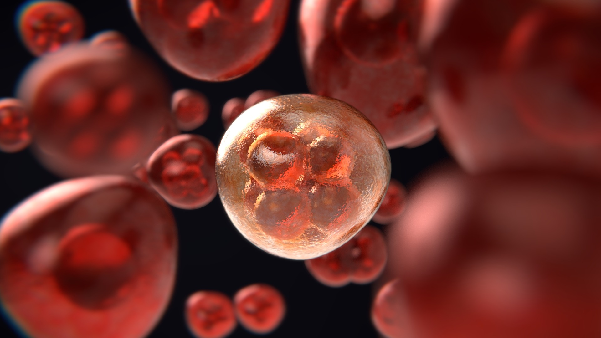

# Melanoma Detection using CNN

## Table of Contents
* [Problem Statement](#problem-statement)
* [Dataset Description](#dataset-description)
* [Note](#note)
* [Project Pipeline](#project-pipeline)
* [Technologies Used](#technologies-used)

## Problem Statement
> In this assignment, we will build a multiclass classification model using a custom convolutional neural network in TensorFlow. 
 
> We will build a CNN based model which can accurately detect melanoma. Melanoma is a type of cancer that can be deadly if not detected early. It accounts for 75% of skin cancer deaths. A solution that can evaluate images and alert dermatologists about the presence of melanoma has the potential to reduce a lot of manual effort needed in diagnosis.

## Dataset Description
> The dataset consists of 2357 images of malignant and benign oncological diseases, which were formed from the International Skin Imaging Collaboration (ISIC). All images were sorted according to the classification taken with ISIC, and all subsets were divided into the same number of images, with the exception of melanomas and moles, whose images are slightly dominant.

> The data set contains the following diseases:
- Actinic keratosis
- Basal cell carcinoma
- Dermatofibroma
- Melanoma
- Nevus
- Pigmented benign keratosis
- Seborrheic keratosis
- Squamous cell carcinoma
- Vascular lesion
> You can download the dataset from [here](https://drive.google.com/file/d/1xLfSQUGDl8ezNNbUkpuHOYvSpTyxVhCs/view)

## Note
- You don't have to use any pre-trained model using Transfer learning. All the model building processes should be based on a custom model.
- Some of the elements introduced in the assignment are new, but proper steps have been taken to ensure smooth learning. You must learn from the base code provided and implement the same for your problem statement.
- The model training may take time to train as you will be working with large epochs. It is advised to use GPU runtime in [Google Colab](https://colab.research.google.com) or any GPU powered device.
- My Device: Apple MacBook Pro 14 inch (2021) with M1 pro chip.

## Project Pipeline
- Data Reading/Data Understanding → Defining the path for train and test images 
- Dataset Creation→ Create train & validation dataset from the train directory with a batch size of 32. Also, make sure you resize your images to 180*180.
- Dataset visualisation → Create a code to visualize one instance of all the nine classes present in the dataset 
- Model Building & training : 
  - Create a CNN model, which can accurately detect 9 classes present in the dataset. While building the model, rescale images to normalize pixel values between (0,1).
  - Choose an appropriate optimiser and loss function for model training
  - Train the model for ~30 epochs
  - Write your findings after the model fit. You must check if there is any evidence of model overfit or underfit.
- Chose an appropriate data augmentation strategy to resolve underfitting/overfitting 
- Model Building & training on the augmented data :
  - Create a CNN model, which can accurately detect 9 classes present in the dataset. While building the model rescale images to normalize pixel values between (0,1).
  - Choose an appropriate optimiser and loss function for model training
  - Train the model for ~30 epochs
  - Write your findings after the model fit, see if the earlier issue is resolved or not?
- Class distribution: Examine the current class distribution in the training dataset 
  - Which class has the least number of samples?
  - Which classes dominate the data in terms of the proportionate number of samples?
- Handling class imbalances: Rectify class imbalances present in the training dataset with [Augmentor](https://augmentor.readthedocs.io/en/master/) library.
- Model Building & training on the rectified class imbalance data :
  - Create a CNN model, which can accurately detect 9 classes present in the dataset. While building the model, rescale images to normalize pixel values between (0,1).
  - Choose an appropriate optimiser and loss function for model training
  - Train the model for ~30 epochs
  - Write your findings after the model fit, see if the issues are resolved or not?

## Technologies Used
- Python - version 3.8.13
- tensorflow - version 2.8.0
- tensorflow-metal - version 0.4.0 (Required for MacBook GPUs)
- Matplotlib - version 3.5.2
- Numpy - version 1.21.6
- Pandas - version 1.4.2
- Device used: Apple MacBook Pro 14 inch (2021) with M1 pro chip.

## Contact (GitHub)
Created by: 
- [Shubhanshu Kumar Singh](https://github.com/shubhanshu1995) 

## Connect with me on LinkedIn:-
- [shubhanshu001](https://www.linkedin.com/in/shubhanshu001/)
